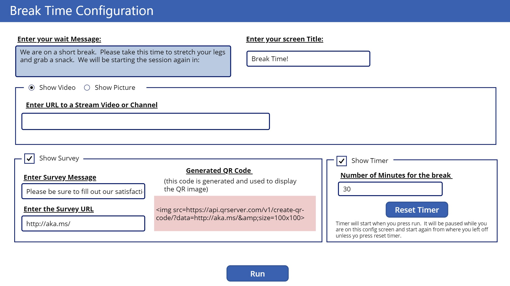

# About BreakTime
This Microsoft PowerApp is a cool utility that allows you to quickly configure an informational screen to display on screen during a meeting break.  The tool can be used for in person or online events as it only requires a browser.  

On Launch you can configure what the tool will display when you run it as follows:

# Video / Picture Settings
The application has a Microsoft Stream Video control to be used with your companies O365 Stream service.  You can add any valid Stream URL and it will play automatically when you press run.  You can also point it to any valid Stream channel.  If you use a Stream Channel you will have to select which video to play once you press run.

If you would like to just display your own static picture, choose picture on the radio button.  When you press run you can then upload the picture you would like to display on the run screen.  Press the 'change picture' in the lower right hand corner once you run.

# Survey URL
There is an optional place to display a survey URL.  What ever URL you type in this box will be displayed along with a QR code for it when you press run.  It does not have to be a survey, it can actually be any URL you like and you can customize the text that describes it.

# Timer
There is an optional Timer.  You can set how many minutes your break will be and the timer will start when you press run.  It will be paused while you are on the config screen and start again from where you left off unless yo press reset timer button.

# Run
When you press the run button the screen will switch and the timer will start.

# Configuration
Once you press run you can get back to the configuration screen anytime by pressing the gear icon in the upper right corner. 

# Installation
Download the .zip file from the PowerAppExport directory and import it into your PowerApps environment.  For instructions on how to import apps into PowerApps see this article: [https://powerapps.microsoft.com/en-us/blog/powerapps-packaging/](https://powerapps.microsoft.com/en-us/blog/powerapps-packaging/)

# Contributing

This project welcomes contributions and suggestions.  Most contributions require you to agree to a
Contributor License Agreement (CLA) declaring that you have the right to, and actually do, grant us
the rights to use your contribution. For details, visit https://cla.opensource.microsoft.com.

When you submit a pull request, a CLA bot will automatically determine whether you need to provide
a CLA and decorate the PR appropriately (e.g., status check, comment). Simply follow the instructions
provided by the bot. You will only need to do this once across all repos using our CLA.

This project has adopted the [Microsoft Open Source Code of Conduct](https://opensource.microsoft.com/codeofconduct/).
For more information see the [Code of Conduct FAQ](https://opensource.microsoft.com/codeofconduct/faq/) or
contact [opencode@microsoft.com](mailto:opencode@microsoft.com) with any additional questions or comments.
